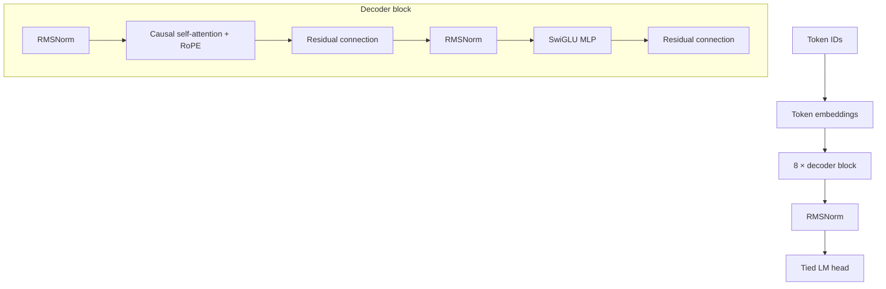

<div align="center">

<a href="https://github.com/DreyzeDev/Myllm-">
  
</a>

# MyLLM V1

### Собственная языковая модель, созданная с нуля

[Репозиторий](https://github.com/DreyzeDev/Myllm-) · Автор: [@DreyzeDev](https://github.com/DreyzeDev)


</div>

> **MyLLM V1 — это обучаемая основа, а не готовый чат-бот.** До обучения веса случайные, поэтому генерация будет бессмысленной. Готовые веса сторонних моделей не используются.

## О проекте

MyLLM V1 — небольшой decoder-only Transformer на PyTorch, который можно обучать на собственных `.txt` и `.jsonl` текстах. Модель, токенизатор и training pipeline собраны для этого проекта; `from_pretrained()` и чужие pretrained checkpoints не загружаются.

### Архитектура



В реализации также есть KV-cache для генерации, causal mask, gradient accumulation, gradient clipping, AdamW, warmup и cosine learning-rate scheduler.

## Конфигурация V1

| Параметр | Значение по умолчанию |
|---|---:|
| Параметры модели | 42 082 816* |
| Размер словаря | 32 000 |
| Длина контекста | 1 024 токена |
| Transformer layers | 8 |
| Hidden size / heads | 512 / 8 |
| SwiGLU intermediate size | 1 408 |
| Position encoding | RoPE |
| Normalization | RMSNorm |
| Embeddings | связанные input/output |

Все значения меняются в [`configs/model_v1.yaml`](configs/model_v1.yaml).  
\* Это размер исходной конфигурации. После обучения BPE-токенизатора скрипт подставляет в модель фактический размер словаря; если текстов мало, параметров будет меньше.

## Установка

```bash
git clone https://github.com/DreyzeDev/Myllm-.git
cd Myllm-
python -m venv .venv
```

Активируйте окружение.

**Windows PowerShell**

```powershell
.venv\Scripts\Activate.ps1
```

**Linux / macOS**

```bash
source .venv/bin/activate
```

Установите зависимости:

```bash
python -m pip install -r requirements.txt
```

При установленной CUDA-сборке PyTorch модель автоматически использует CUDA; иначе код работает на CPU.

## Быстрая проверка

```bash
python scripts/sanity_check.py
python -m pytest -q
```

Sanity check создаёт маленькую модель со случайными весами, делает один optimizer step, сохраняет и загружает checkpoint во временную папку. Он не запускает обучение V1 и не скачивает датасеты.

## Подготовка своих данных

Поместите файлы в `data/raw/`:

- `.txt` — обычный текст; пустые строки и записи будут удалены;
- `.jsonl` — JSON-объекты с текстовым полем `text` или JSON-строки.

Текст приводится к Unicode NFC, точные дубликаты удаляются. Train/validation разделяются до токенизации. Большой текст из одной записи делится на непересекающиеся части по границе слов.

### 1. Обучите tokenizer

BPE обучается только на ваших текстах. Добавляются `<pad>`, `<bos>`, `<eos>`, `<unk>`, `<|system|>`, `<|user|>` и `<|assistant|>`.

```bash
python scripts/train_tokenizer.py --input data/raw
```

Результат сохраняется в `tokenizer/tokenizer.json`. Конфиг модели автоматически обновит `model.vocab_size` до фактического размера словаря.

### 2. Подготовьте token blocks

```bash
python scripts/prepare_dataset.py \
  --input data/raw \
  --tokenizer tokenizer/tokenizer.json \
  --output data/processed \
  --context-length 1024 \
  --validation-fraction 0.01
```

Длина контекста в команде должна совпадать с `model.context_length` в YAML. Если корпус пока маленький, уменьшите оба значения. Подготовленные бинарные блоки и metadata создаются локально и не попадают в Git.

## Обучение

Проверьте параметры в `configs/model_v1.yaml`, затем запустите обучение самостоятельно:

```bash
python scripts/train_v1.py --config configs/model_v1.yaml
```

Training pipeline поддерживает validation loss и perplexity, логи, сохранение/возобновление checkpoint, BF16 на подходящем GPU и FP16 fallback. Полное обучение при подготовке этого репозитория не запускалось.

Продолжить обучение из checkpoint:

```bash
python scripts/train_v1.py \
  --config configs/model_v1.yaml \
  --resume-from checkpoints/step_00500
```

`max_steps` задаёт итоговый номер шага, до которого нужно обучать. Checkpoint хранит веса, optimizer, scheduler, scaler и состояние обучения.

## Evaluation и генерация

Посчитать validation loss и perplexity:

```bash
python -m src.evaluate \
  --checkpoint checkpoints/step_00500 \
  --data data/processed
```

Интерактивный чат:

```bash
python scripts/chat.py \
  --checkpoint checkpoints/step_00500 \
  --tokenizer tokenizer/tokenizer.json
```

Сгенерировать продолжение одного prompt:

```bash
python -m src.generate \
  --checkpoint checkpoints/step_00500 \
  --tokenizer tokenizer/tokenizer.json \
  --prompt "Привет" \
  --max-new-tokens 80 \
  --temperature 0.8 --top-k 50 --top-p 0.95 --seed 42
```

## Структура проекта

```text
configs/        настройки модели и обучения
src/            модель, attention, tokenizer, dataset, train, evaluate, generation
scripts/        команды для tokenizer, данных, обучения, чата и sanity check
tests/          тесты модели, attention, tokenizer, данных и training step
data/raw/       ваши исходные тексты
data/processed/ подготовленные блоки (локальные, игнорируются Git)
checkpoints/    checkpoints (локальные, игнорируются Git)
```

## Ограничения V1

Одна GPU или CPU, один процесс, без distributed training. Формат блоков использует `uint16`, поэтому словарь ограничен 65 536 токенами. Начните с небольшого корпуса и проверяйте validation loss перед увеличением числа шагов или размера модели.

<div align="center">

Создано с нуля · [DreyzeDev](https://github.com/DreyzeDev) · [Myllm-](https://github.com/DreyzeDev/Myllm-)

</div>
