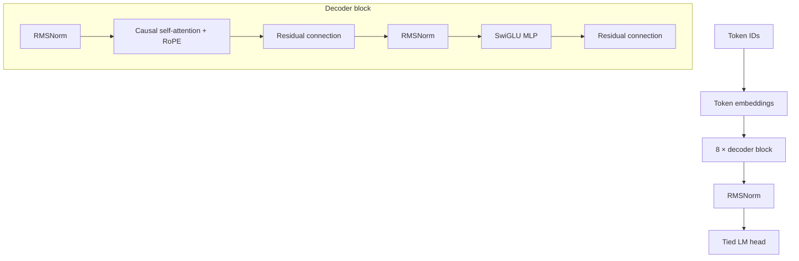

<div align="center">

<a href="https://github.com/DreyzeDev/Myllm-">
  
</a>

<h1>MyLLM V1</h1>

<h3>Собственная языковая модель, созданная с нуля</h3>

<p><a href="https://github.com/DreyzeDev/Myllm-">Репозиторий</a> · Автор: <a href="https://github.com/DreyzeDev">@DreyzeDev</a></p>


</div>

> **MyLLM V1 — это обучаемая основа, а не готовый чат-бот.** До обучения веса случайные, поэтому генерация будет бессмысленной. Готовые веса сторонних моделей не используются.

## О проекте

MyLLM V1 — небольшой decoder-only Transformer на PyTorch, который можно обучать на собственных `.txt` и `.jsonl` текстах. Модель, токенизатор и training pipeline собраны для этого проекта; `from_pretrained()` и чужие pretrained checkpoints не загружаются.

### Архитектура



В реализации также есть KV-cache для генерации, causal mask, gradient accumulation, gradient clipping, AdamW, warmup и cosine learning-rate scheduler.

## Конфигурация V1

| Параметр | Значение по умолчанию |
|---|---:|
| Параметры модели | 42 082 816* |
| Размер словаря | 32 000 |
| Длина контекста | 1 024 токена |
| Transformer layers | 8 |
| Hidden size / heads | 512 / 8 |
| SwiGLU intermediate size | 1 408 |
| Position encoding | RoPE |
| Normalization | RMSNorm |
| Embeddings | связанные input/output |

Все значения меняются в [`configs/model_v1.yaml`](configs/model_v1.yaml).  
\* Это размер исходной конфигурации. После обучения BPE-токенизатора скрипт подставляет в модель фактический размер словаря; если текстов мало, параметров будет меньше.

## Установка

```bash
git clone https://github.com/DreyzeDev/Myllm-.git
cd Myllm-
python -m venv .venv
```

Активируйте окружение.

**Windows PowerShell**

```powershell
.venv\Scripts\Activate.ps1
```

**Linux / macOS**

```bash
source .venv/bin/activate
```

Установите зависимости:

```bash
python -m pip install -r requirements.txt
```

При установленной CUDA-сборке PyTorch модель автоматически использует CUDA; иначе код работает на CPU.

## Быстрая проверка

```bash
python scripts/sanity_check.py
python -m pytest -q
```

Sanity check создаёт маленькую модель со случайными весами, делает один optimizer step, сохраняет и загружает checkpoint во временную папку. Он не запускает обучение V1 и не скачивает датасеты.

## Подготовка своих данных

Поместите файлы в `data/raw/`:

- `.txt` — обычный текст; пустые строки и записи будут удалены;
- `.jsonl` — JSON-объекты с текстовым полем `text` или JSON-строки.

Текст приводится к Unicode NFC, точные дубликаты удаляются. Train/validation разделяются до токенизации. Большой текст из одной записи делится на непересекающиеся части по границе слов.

### Стартовый корпус

В проекте есть воспроизводимые скрипты для небольшой русскоязычной коллекции
общественно-доступных текстов и двух английских книг. Исходники и очищенный
JSONL хранятся локально и не коммитятся в GitHub. Manifest фиксирует ссылки,
лицензионные заметки и размеры; краткая статистика лежит в
[`data/stats.json`](data/stats.json).

```bash
python scripts/download_dataset.py
python scripts/clean_dataset.py --input data/raw --output data/cleaned
```

Загрузчик проверяет закреплённую версию RSD и контрольные суммы Project
Gutenberg; по умолчанию размер загрузки ограничен 128 MiB. Project Gutenberg
указывает, что его тексты public domain в США; перед использованием за пределами
США проверьте местное законодательство. Детали и границы проверки описаны в
[`data/README.md`](data/README.md).

Для расширенного русскоязычного корпуса V1 доступны закреплённые дампы
Wikimedia: русская Википедия, Simple English Wikipedia и English Wikibooks.
Команды в PowerShell:

```powershell
python scripts/download_wikimedia.py --output data/raw/wikimedia --max-download-gb 8
python scripts/extract_wikimedia.py --input data/raw/wikimedia/ruwiki-20260901-pages-articles-multistream.xml.bz2 --output data/raw/wikimedia/ruwiki.jsonl
python scripts/extract_wikimedia.py --input data/raw/wikimedia/simplewiki-20260901-pages-articles-multistream.xml.bz2 --output data/raw/wikimedia/simplewiki.jsonl
python scripts/extract_wikimedia.py --input data/raw/wikimedia/enwikibooks-20260901-pages-articles-multistream.xml.bz2 --output data/raw/wikimedia/enwikibooks.jsonl
python scripts/clean_dataset.py --input data/raw --output data/cleaned
```

Манифест закрепляет ссылки, лицензии и контрольные суммы. Extractor сохраняет
URL каждой Wiki-страницы для атрибуции. Очистка, обучение tokenizer и создание
блоков обрабатывают документы по одному и не загружают весь корпус в память.

### 1. Обучите tokenizer

BPE обучается только на ваших текстах. Добавляются `<pad>`, `<bos>`, `<eos>`, `<unk>`, `<|system|>`, `<|user|>` и `<|assistant|>`.

```bash
python scripts/train_tokenizer.py --input data/cleaned/corpus.jsonl
```

Результат сохраняется в `tokenizer/tokenizer.json`. Конфиг модели автоматически обновит `model.vocab_size` до фактического размера словаря.

### 2. Подготовьте token blocks

```bash
python scripts/prepare_dataset.py \
  --input data/cleaned/corpus.jsonl \
  --tokenizer tokenizer/tokenizer.json \
  --output data/processed \
  --context-length 1024 \
  --validation-fraction 0.01
```

Длина контекста в команде должна совпадать с `model.context_length` в YAML. Если корпус пока маленький, уменьшите оба значения. Подготовленные бинарные блоки и metadata создаются локально и не попадают в Git.

## Обучение

Проверьте параметры в `configs/model_v1.yaml`, затем запустите обучение самостоятельно:

```bash
python scripts/train_v1.py --config configs/model_v1.yaml
```

Training pipeline поддерживает validation loss и perplexity, логи, сохранение/возобновление checkpoint, BF16 на подходящем GPU и FP16 fallback. Первый полный pretraining V1 с нуля прошёл на RTX 5060 с CUDA и BF16. Прогон приостановлен на сохранённом checkpoint `step_04600`; целевой объём этого запуска — 16 000 шагов.

Продолжить обучение из checkpoint:

```bash
python scripts/train_v1.py \
  --config configs/model_v1.yaml \
  --resume-from checkpoints/v1-pretraining/step_04600
```

`max_steps` задаёт итоговый номер шага, до которого нужно обучать. Checkpoint хранит веса, optimizer, scheduler, scaler и состояние обучения.

### Результат первого цикла pretraining

Модель обучалась с исходной конфигурацией V1 и случайной инициализацией: 42 082 816 параметров, context length 1 024, micro-batch 4 и gradient accumulation 8 (32 768 токенов на optimizer step). Использовались CUDA, BF16 и AdamW.

| Показатель | Результат |
|---|---:|
| Источники | RSD (161 документ), 2 книги Project Gutenberg, русская Википедия, Simple English Wikipedia, English Wikibooks |
| Скачанный корпус | около 6,89 GB |
| Очищенный корпус | 12,91 GB текста; 2 166 063 документа; 1 101 292 823 слова |
| Языки по словам | русский 87,65%; английский 12,35% |
| Оценка объёма после токенизации | около 2 097 957 189 токенов |
| Tokenizer | byte-level BPE, обучен с нуля, словарь 32 000; обучение на детерминированной выборке 10% документов |
| Token blocks | context 1 024; train 2 026 536; validation 20 250 |
| Обучено на checkpoint | 4 600 шагов; 150 732 800 токенов |
| Train loss | 10,498 в начале; 3,267 на checkpoint `step_04600` |
| Validation loss | 3,880; последняя оценка на шаге 4 500 |
| Checkpoint | `checkpoints/v1-pretraining/step_04600` |

Train/validation разделены на уровне документов по SHA-256 с seed 42; в validation выделено 1% документов. Возобновление было проверено на полном корпусе коротким smoke-run. Зафиксированных NaN/Inf и CUDA OOM не было. Результаты расширенного корпуса и запуска хранятся в [`data/source_manifest.yaml`](data/source_manifest.yaml); исходные тексты, token blocks и checkpoints остаются локальными и не коммитятся.

Это промежуточный base checkpoint, а не готовый чат-бот. Проверка генерации показала более структурированный текст, чем у необученной модели, но знания и продолжения пока ненадёжны; например, на prompt «Солнечная система состоит» модель выдала неверное продолжение «из трёх частей». Обучение можно продолжить командой выше.

## Evaluation и генерация

Посчитать validation loss и perplexity:

```bash
python -m src.evaluate \
  --checkpoint checkpoints/v1-pretraining/step_04600 \
  --data data/processed/full_v1
```

Интерактивный чат:

```bash
python scripts/chat.py \
  --checkpoint checkpoints/v1-pretraining/step_04600 \
  --tokenizer tokenizer/tokenizer.json
```

Сгенерировать продолжение одного prompt:

```bash
python -m src.generate \
  --checkpoint checkpoints/v1-pretraining/step_04600 \
  --tokenizer tokenizer/tokenizer.json \
  --prompt "Привет" \
  --max-new-tokens 80 \
  --temperature 0.8 --top-k 50 --top-p 0.95 --seed 42
```

## Структура проекта

```text
configs/        настройки модели и обучения
src/            модель, attention, tokenizer, dataset, train, evaluate, generation
scripts/        команды для tokenizer, данных, обучения, чата и sanity check
tests/          тесты модели, attention, tokenizer, данных и training step
data/raw/       исходные тексты (локально, игнорируются Git)
data/cleaned/   очищенный starter corpus и статистика (локально)
data/processed/ подготовленные блоки (локальные, игнорируются Git)
checkpoints/    checkpoints (локальные, игнорируются Git)
```

## Ограничения V1

Одна GPU или CPU, один процесс, без distributed training. Формат блоков использует `uint16`, поэтому словарь ограничен 65 536 токенами. Начните с небольшого корпуса и проверяйте validation loss перед увеличением числа шагов или размера модели.

<div align="center">

Создано с нуля · [DreyzeDev](https://github.com/DreyzeDev) · [Myllm-](https://github.com/DreyzeDev/Myllm-)

</div>
